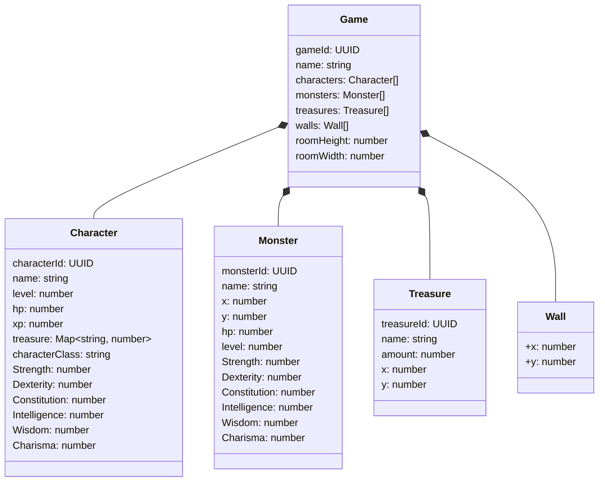

# Fortis Dungeon Master

[](https://github.com/jarrodconnolly/fortis-dungeon-master/actions/workflows/ci.yml)


## Overview

Fortis Dungeon Master is a Typescript API which implements a dungeon style game server. It allows players to create and manage characters, explore dungeons, and engage in combat with monsters.

## Features

- Character creation
- Map creation
- Combat with monsters
- Treasure collection
- Basic game mechanics and rules
- Uses Faker to generate random character, monster, treasure and dungeon names
- Persistent data storage using [Lowdb](https://github.com/typicode/lowdb)
  - Had some features that looked helpful for this project.
  - JSON file based
  - auto-in-memory for unit tests.
- Simple RESTful API for interaction
- Error handling and validation
- Unit tests for core components
  - Tests use built-in Node.js testing framework
- Structured logging for debugging and monitoring
  - Pretty logs for development
- CLI client for testing and interaction
  - CLI is rougher and not as polished as the API, but it allows for quick testing and interaction with the game server.
- Postman collection for API testing

## Features.next

- Websocket API for realtime interactions
  - DM story messages
  - Visual updates as other players take actions
- CLI needs Quality of Life improvements
  - Using long UUID for everything is rough.
  - Improve error handling and user feedback in the CLI.
- Proper error classes, handle what errors clients see better
- Game join codes: Allow players to join games using unique codes
- Player management: Track which players are in which games (currently only the game knows)
- Clean up API parameters. Query Param, Post Body, Path Param
- API documentation: Generate OpenAPI documentation for the API endpoints
- Observability: Metrics, tracing
- Types are mixed with implementation

## Design

The project uses a modular structure that keeps core game logic, data models, and API routes organized for easy maintenance and understanding.

The backend is built with Fastify and TypeScript and provides a RESTful API for interacting with the game.

Data is stored and persisted with Lowdb, and TypeScript interfaces are used throughout to keep the code type safe.

Each main feature, like character management, dungeon exploration, and combat, lives in its own module so the codebase is simple to extend and test.

## Challenges

- Am I building a real-time multiplayer game or a turn-based game?
- How do we handle game state and persistence?
- Player versus DM authentication and authorization.
- Duplication of class data and db data structures.
- Single PUT update call for game state.

## Technology Stack

- **Node.js**: JavaScript runtime for building the API.
- **TypeScript**: Superset of JavaScript for type safety.
- **Fastify**: Web framework for building the API.
- **Lowdb**: Lightweight database for persistent storage.
- **Unit Testing**: Using built-in Node.js testing.

## Data Models

The data models are defined using TypeScript interfaces, ensuring type safety and clarity. The main models include:

### Game

Represents a game session, including the player character, monsters, and treasures.

### Character

Represents a player character, including stats, inventory, and abilities.

### Monster

Represents monsters in the game, including stats and behaviors.

### Treasure

Represents treasures in the game, including properties and effects.

## Data Diagrams



## Usage

To start playing Fortis Dungeon Master, follow these steps:

Clone the repository:

```bash
git clone https://github.com/jarrodconnolly/fortis-dungeon-master.git
cd fortis-dungeon-master
```

Install dependencies:

```bash
npm install
```

Run the tests:

```bash
npm test
```

Start the server:

```bash
npm start
```

Start the CLI client:

```bash
npm run client
```

Test with Postman:

- Postman collection is available in the `postman` directory.
- Import the collection and environment to test the API endpoints.

## Play the Game

To play the game, you can use the CLI client or the RESTful API. The CLI client provides a simple interface to create characters, explore dungeons, and engage in combat.

`help` command in the CLI will show you the available commands and how to use them.

## Known Issues

The game is still in early development, and some features are not yet implemented.

## Changelog

- **v1.0.0** - Initial release with basic functionality
